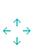
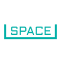
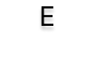
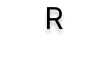

# Mirror-Skies
Deux avions, un pilote !
Dans Mirror Skies, vous contrôlez deux avions en parallèle, leurs mouvements étant synchronisés de chaque côté de l’écran. Cependant, le ciel est plein de dangers, et peu importe les obstacles, vos deux avions doivent finir la course.

### Détruisez les ennemis qui vous barrent la route !
Mais prenez garde à ne pas gaspiller vos munitions ! Qui sait, vous pourriez finir par en avoir vraiment besoin...

### Rammassez des pièces et battez votre record !
Certaines zones bonus peuvent vous rapporter plus de pièces, serez-vous prêt à prendre des risques ?

### Évitez les obstacles !
A vous de faire en sorte que vos deux vaisseaux s'en sortent indemnes ! La moindre erreur peut vous coûter cher, prenez garde aux bords.
Les plateformes translucides sont destructibles, les tourelles vous tirent dessus ! 

## Tutoriel

## Informations complémentaires
Étudiants en Informatique à l'Université Savoie Mont Blanc, nous avons réalisé ce jeu dans le cadre de notre projet VISI301, le but étant de réaliser un petit jeu en utilisant la librairie Pygame.

## Instalation

### Pré-requis :
- Python 3.X
- Pygame
### Votre menu n'est pas aussi beau que le nôtre ?
Pas de panique : télécharger les fonts présentes dans le dossier "assets" !

Pour lancer le jeu, exécutez le fichier main.py avec Python.

## Crédits
Etudiants :
- BOUDJAJ Hania
- ANTOINE Alexis

Tuteurs :
- HYVERNAT Pierre
- GLEDEL Valentin
